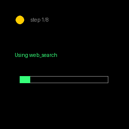

# Giving Noa a Body

Noa is a great **head** — it hears you and talks back. This gives it a **body**:
a multi-step agentic worker (TANI) that Noa can hand real work to, with live,
glanceable status streamed to the Halo display — no phone, no scrolling.

It's not a replacement for Noa. It's the capability tier *above* it.

```
   you ──speak──▶  Noa (head)  ──tool call──▶  TANI (body)  ──does the work
                                     │              │
                                     │              └──status──▶  Halo display
                                     ▼
                                 talks back
```

This repo is a **Brilliant SDK host app**. Clone it, run it on your Halo, watch
TANI work on the lens. No web mock — real glasses (or the Python emulator).



> **Verified, live.** The frames above are real output from **live production
> TANI** (a real agent doing a real web search) streamed to Brilliant's Python
> emulator running `app.py` end-to-end. No signup — `app.py` mints an ephemeral
> guest token against `https://tani.senulmapa.com/api`. The same code targets a
> real Halo over BLE: the only difference is the one-line swap in `make_frame()`.

## Run it on your Halo
```bash
pip install -r requirements.txt
python app.py "build me a landing page for a coffee shop"
```
It scans for the first Halo over BLE, connects, and streams status to the display:
a status dot, the current step, and a progress bar (drawn with `frame.display.*`).

## Test without a Halo (Python emulator)
The same `app.py` runs against Brilliant's experimental emulator — identical code,
the only difference is one line in `make_frame()`. Install the emulator editable
from the SDK repo, then pass `--emulator`:
```bash
git clone https://github.com/brilliantlabsAR/brilliant_sdk.git
cd brilliant_sdk/python && uv sync --all-packages && cd -
python app.py --emulator "build me a landing page for a coffee shop"
```
A 256×256 pygame window opens and renders exactly what a Halo would show.

## Files
| File               | What it is                                                        |
|--------------------|-------------------------------------------------------------------|
| `app.py`           | the host app — connect, run a task, stream status (hardware OR emulator) |
| `hud.py`           | status event → Halo draw call (`frame.display.text/rect/circle`)  |
| `tani.py`          | the agentic worker — **edit here to wire real TANI/Hermes**       |
| `noa_tani_tool.py` | drop-in tool for `noa-assistant`, in their exact function-call schema |
| `requirements.txt` | `brilliant-sdk`                                                    |

## Wire in real TANI
Edit `tani.py` — one function. Replace the fake steps in `run_task()` with a real
TANI run and funnel whatever it emits (structured events / raw text / final
answer) through `on_status({step, status, summary, progress})`. `hud.py` doesn't
care how TANI works, only that it gets status.

## Guest access — try real TANI now, no signup
**It's live** at `https://tani.senulmapa.com/api`. Run a real TANI task on the
emulator with one command — `app.py` mints an **ephemeral guest token** (no
account, no secret in this repo, minted per run, expires in minutes):
```bash
TANI_API=https://tani.senulmapa.com/api python app.py --emulator "compare the gdp of japan and germany"
```
Unset `TANI_API` → offline demo steps, so a fresh clone still runs with zero backend.

The backend implements two endpoints:

```
POST /guest
  → 200 { "token": "<short-lived>", "expires_in": 600 }
  Mints a guest session. MUST be short-TTL (~10 min), rate-limited per IP, and
  capability-scoped (demo tasks only — no billing, no destructive operations).

POST /run     (header: Authorization: Bearer <token>)
  body: { "task": "..." }
  → text/event-stream:
      data: {"step":"step 1/3","status":"running","summary":"…","progress":0.0}
      …
      data: {"status":"done","summary":"<final headline>","progress":1.0}
```

**Security:** the repo holds no token. Guests are minted on demand, expire fast,
and are rate-limited + scoped server-side — so the public URL can't be abused
even though anyone can call `/guest`.

## The path onto Noa (no MCP needed)
Noa's backend (`brilliantlabsAR/noa-assistant`) is open-source Python and already
does native LLM **function-calling** — tools live in a `TOOLS` list + `tool_functions`
dict in `gpt_assistant.py` / `claude_assistant.py`. And the Noa app exposes a
**custom-server** mode (`isCustomServerEnabled` / `apiEndpoint`) so real glasses can
point at your own backend. Adding `run_tani_task` from `noa_tani_tool.py` to those
two dicts is the whole integration: Noa stays the head, TANI becomes a hand.
